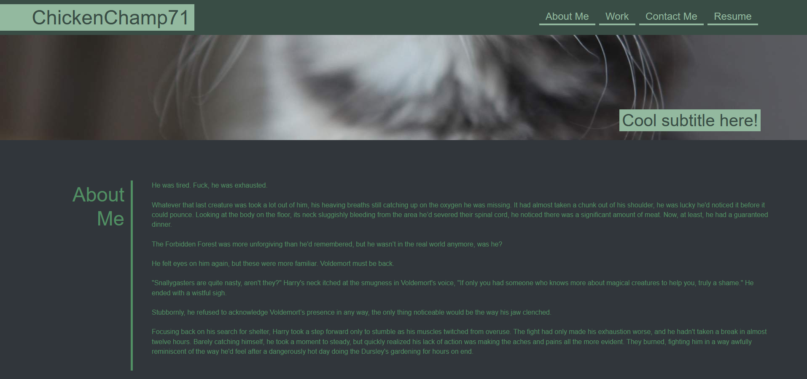
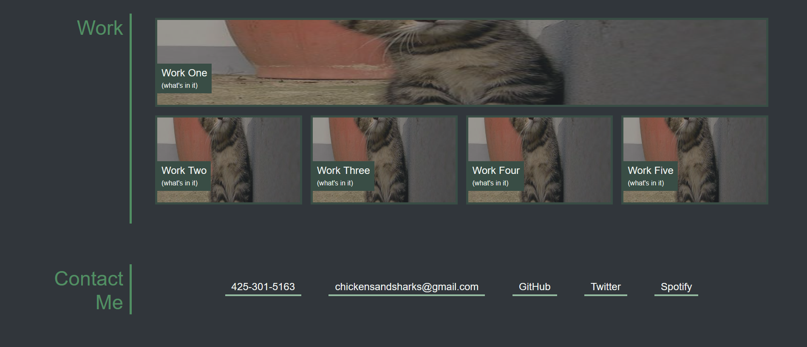

# Portfolio Challenge 2

## Description

The purpose of this challenge was to make a functioning portfolio similar to the images we were given. Building from the ground up, I created the portfolio with unique colors and aspects as well as other functioning elements.

## Installation

N/A

## Usage

chickenchamp71.github.io/portfolio-challenge-2

## Credits

N/A

## License

See license in repo.
